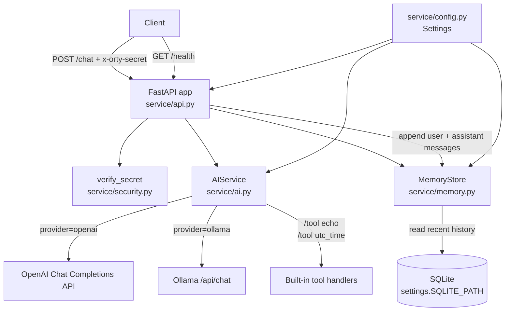

# Orty


Orty is a modular, on-device AI assistant built with FastAPI and designed for clean architecture, extensibility, and local-first operation. The project is currently in early alpha and focused on building a solid architectural foundation before feature expansion.

## Status

Version: v0.1.0-alpha
Current Phase: Conversation controls + safer tool contracts
Next Phase: Automation extensions

---

## Current Roadmap Position

Orty is currently in **v0.1.0-alpha** and in the **LLM abstraction + built-in tools + SQLite memory** phase.

### What is already in place
- FastAPI application structure and running server entrypoint
- Health endpoint and request authentication via registered clients (with shared-secret root fallback)
- Chat endpoint with OpenAI/Ollama provider routing and pluggable provider registry
- Built-in tool execution (`echo`, `utc_time`, and filesystem helper tools)
- SQLite-backed conversation memory with recent-history retrieval
- Client-scoped memory and per-client preferences for registered clients
- Supervisor-managed bot lifecycle APIs with `heartbeat`, `code_review`, and `automation_extensions` bot types
- Conversation controls in `/chat` (`history_limit`, `reset_conversation`, `persist`)
- Safer tool contracts with bounded tool input and stricter `owner/repo` validation for GitHub tools

### What comes next
The next planned milestone is **automation extensions**.

### User Interface Status
- Orty now includes a **simple built-in web UI** for quick manual testing.
- Open `GET /ui` in a browser to chat as the primary root client without manually setting secrets, and continue conversations via `conversation_id`.
- The backend remains API-first (`/chat`, `/health`, and `/v1/...` endpoints), with the web UI acting as a lightweight test client.
- Creating additional registered clients via `POST /v1/clients` requires the admin shared secret (`x-orty-secret`).

---


## Architecture Overview

Orty follows a clean architecture approach:

* API Layer (FastAPI routers)
* Service Layer (business logic)
* Storage Layer (persistence abstraction)
* LLM Provider Abstraction (model interface layer)

The system is designed to support:

* Local or remote LLM providers
* Pluggable storage backends
* Secure request authentication
* Future tool integration and automation

### Project Architecture Diagram



Request flow summary:
1. `/chat` verifies `x-orty-secret`, then loads recent conversation history from SQLite.
2. `AIService` either executes a built-in tool command or routes to the configured LLM provider.
3. User + assistant messages are persisted, and the assistant reply is returned with `conversation_id`.

---

## Tech Stack

* Python 3.12+
* FastAPI
* Uvicorn
* SQLite (memory persistence enabled, WAL mode, configurable connection timeout)
* OpenAI and Ollama provider support
* Git for version control

Designed to run in Termux (Android) or any Linux environment.

---

## Project Structure

```
orty/
├── service/
│   ├── api/
│   ├── llm/
│   ├── storage/
│   └── conversation/
├── main.py
├── requirements.txt
└── .env
```

Structure will evolve as persistence and conversation management are added.

---

## Setup Instructions

### 1. Clone the Repository

```
git clone https://github.com/ortluk-hub/Orty.git
cd Orty
```

### 2. Create Virtual Environment (Recommended)

```
python -m venv venv
source venv/bin/activate
```

### 3. Install Dependencies

```
pip install -r requirements.txt
```

### 4. Configure Environment Variables

Create a `.env` file in the project root:

```
ORTY_SHARED_SECRET=your_shared_secret_here
LLM_PROVIDER=ollama
OPENAI_API_KEY=your_openai_key_here
# or for local models
# LLM_PROVIDER=openai
# OLLAMA_BASE_URL=http://localhost:11434
# OLLAMA_MODEL=llama3.2
SQLITE_PATH=data/orty.db
SQLITE_TIMEOUT_SECONDS=5
```

This value is required for API authentication.

---

## Running the Server

```
uvicorn main:app --host 0.0.0.0 --port 8080
```

Health check endpoint:

```
GET /health
```

Expected response:

```
{"status": "ok"}
```

## Running Orty + LLM in Separate Docker Containers (Same Host)

Use this setup when:
- Orty API runs in one container
- Ollama (LLM runtime) runs in a separate container
- Client devices are on the same LAN and call the Orty host directly

### 1. Create a dedicated Docker network

```bash
docker network create orty-net
```

### 2. Start the LLM container (Ollama)

```bash
docker run -d \
  --name ollama \
  --network orty-net \
  -p 11434:11434 \
  ollama/ollama
```

Pull the model you want Orty to use (example: `llama3.2`):

```bash
docker exec -it ollama ollama pull llama3.2
```

### 3. Build and run Orty container

From the Orty repository root (`Dockerfile` is included in this repo):

```bash
docker build -t orty:local .

docker run -d \
  --name orty \
  --network orty-net \
  -p 8080:8080 \
  -e ORTY_SHARED_SECRET=your_shared_secret_here \
  -e LLM_PROVIDER=ollama \
  -e OLLAMA_BASE_URL=http://ollama:11434 \
  -e OLLAMA_MODEL=llama3.2 \
  -e SQLITE_PATH=/app/data/orty.db \
  -v orty_data:/app/data \
  orty:local
```

### 4. Access from clients on the same network

Use the Orty host machine IP from client devices:

- Health: `http://<host-ip>:8080/health`
- Chat: `http://<host-ip>:8080/chat`

Example:

```bash
curl -X POST "http://<host-ip>:8080/chat" \
  -H "Content-Type: application/json" \
  -H "x-orty-secret: your_shared_secret_here" \
  -d '{"message":"Hello from LAN client"}'
```

Notes:
- `OLLAMA_BASE_URL` must use the Ollama container name (`http://ollama:11434`) when both containers are on the same Docker network.
- Keep port `8080` open on the host firewall for LAN clients.
- If Orty cannot reach Ollama, verify both containers are on `orty-net` (`docker network inspect orty-net`).


Tool usage (initial built-in support):

- Use `/tool echo <text>` to return text directly
- Use `/tool utc_time` to return current UTC timestamp

If a tool command is used, Orty executes the tool first and returns the tool result.

Chat endpoint now supports lightweight memory persistence via SQLite:

Supervisor automation notes:

- `code_review` bots can clone a target repository, inspect configured roadmap text, and emit roadmap-aligned change proposals via `/v1/bots/{bot_id}/events`.
- The bot can optionally use `conversation_id` memory to weight proposal relevance from recent chat history.
- Every proposal includes `human_review_required=true`; generated ideas are intended for human-reviewed pull requests before merge.
- `automation_extensions` bots generate integration-target execution plans (for example: GitHub, Slack, and Notion) and raise target priority when chat memory shows explicit demand.


- include optional `conversation_id` in `/chat` requests to continue a thread
- if omitted, Orty creates a new `conversation_id` and returns it in the response

---

## Authentication

All protected endpoints require the following header:

```
x-orty-secret: <your_shared_secret>
```

Requests without this header or with an invalid value will be rejected.

---

## Development Workflow

* `main` branch → Stable releases
* `dev` branch → Active development

Create features in `dev` and merge when ready.

Version tags are used for milestone tracking.

---

## Roadmap

### What’s next (near-term)
1. **Conversation lifecycle controls**
   - Add explicit APIs to inspect/reset/archive conversations
   - Improve conversation metadata handling for multi-session usage
2. **Safer, extensible tool contracts**
   - Formalize tool input/output schemas and validation rules
   - Add guardrails (path limits, execution policy, audit logging)
3. **Automation + integration expansion**
   - Add structured hooks for scheduled/triggered actions
   - Prepare connectors for external services while keeping local-first defaults

### Full roadmap
* Conversation management system
* Advanced memory retrieval + summarization
* Expanded secure automation integrations
* LLM abstraction layer
* Tool execution framework
* Background task system
* Smart home and automation integrations
* On-device model support

---

## Philosophy

Orty is built as a system, not a script.
The focus is clean structure, modularity, and long-term scalability.

---

If you'd like, we can now:

* Add a version badge
* Add a project architecture diagram
* Prepare a v0.2 milestone plan
* Or wire in SQLite and commit the next evolutionary step

Orty is now officially documented.
