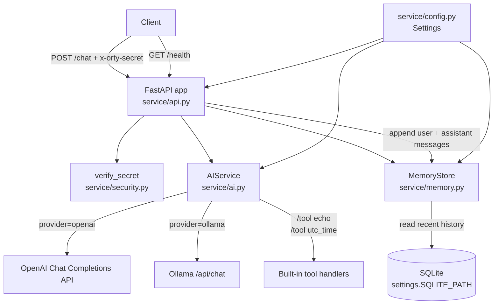

# Orty

Orty is a modular, on-device AI assistant built with FastAPI and designed for clean architecture, extensibility, and local-first operation. The project is currently in early alpha and focused on building a solid architectural foundation before feature expansion.

## Status

Version: v0.1.0-alpha
Current Phase: Core API + Authentication + SQLite memory
Next Phase: LLM abstraction refinement and tool execution support

---

## Current Roadmap Position

Orty is currently in **v0.1.0-alpha** and in the **Core API + Authentication + SQLite memory** phase.

### What is already in place
- FastAPI application structure and running server entrypoint
- Health endpoint
- Shared-secret request authentication
- Basic chat endpoint wired to an LLM provider call

### What comes next
The next planned milestone is **LLM abstraction refinement and tool execution support**, followed by broader automation integrations.

---


## Architecture Overview

Orty follows a clean architecture approach:

* API Layer (FastAPI routers)
* Service Layer (business logic)
* Storage Layer (persistence abstraction)
* LLM Provider Abstraction (model interface layer)

The system is designed to support:

* Local or remote LLM providers
* Pluggable storage backends
* Secure request authentication
* Future tool integration and automation

### Project Architecture Diagram



Request flow summary:
1. `/chat` verifies `x-orty-secret`, then loads recent conversation history from SQLite.
2. `AIService` either executes a built-in tool command or routes to the configured LLM provider.
3. User + assistant messages are persisted, and the assistant reply is returned with `conversation_id`.

---

## Tech Stack

* Python 3.12+
* FastAPI
* Uvicorn
* SQLite (memory persistence enabled, WAL mode, configurable connection timeout)
* OpenAI and Ollama provider support
* Git for version control

Designed to run in Termux (Android) or any Linux environment.

---

## Project Structure

```
orty/
├── service/
│   ├── api/
│   ├── llm/
│   ├── storage/
│   └── conversation/
├── main.py
├── requirements.txt
└── .env
```

Structure will evolve as persistence and conversation management are added.

---

## Setup Instructions

### 1. Clone the Repository

```
git clone https://github.com/ortluk-hub/Orty.git
cd Orty
```

### 2. Create Virtual Environment (Recommended)

```
python -m venv venv
source venv/bin/activate
```

### 3. Install Dependencies

```
pip install -r requirements.txt
```

### 4. Configure Environment Variables

Create a `.env` file in the project root:

```
ORTY_SHARED_SECRET=your_shared_secret_here
LLM_PROVIDER=openai
OPENAI_API_KEY=your_openai_key_here
# or for local models
# LLM_PROVIDER=ollama
# OLLAMA_BASE_URL=http://localhost:11434
# OLLAMA_MODEL=llama3.2
SQLITE_PATH=data/orty.db
SQLITE_TIMEOUT_SECONDS=5
```

This value is required for API authentication.

---

## Running the Server

```
uvicorn main:app --host 0.0.0.0 --port 8080
```

Health check endpoint:

```
GET /health
```

Expected response:

```
{"status": "ok"}
```


Tool usage (initial built-in support):

- Use `/tool echo <text>` to return text directly
- Use `/tool utc_time` to return current UTC timestamp

If a tool command is used, Orty executes the tool first and returns the tool result.

Chat endpoint now supports lightweight memory persistence via SQLite:

- include optional `conversation_id` in `/chat` requests to continue a thread
- if omitted, Orty creates a new `conversation_id` and returns it in the response

---

## Authentication

All protected endpoints require the following header:

```
x-orty-secret: <your_shared_secret>
```

Requests without this header or with an invalid value will be rejected.

---

## Development Workflow

* `main` branch → Stable releases
* `dev` branch → Active development

Create features in `dev` and merge when ready.

Version tags are used for milestone tracking.

---

## Roadmap

### What’s next (near-term)
1. **LLM abstraction refinement**
   - Standardize provider interfaces (OpenAI/Ollama)
   - Improve provider selection and error handling paths
2. **Tool execution support**
   - Define safe tool interface contracts
   - Add first internal tool(s) behind auth and validation
3. **Conversation + memory evolution**
   - Expand conversation lifecycle controls
   - Improve memory retrieval behavior across turns

### Full roadmap
* SQLite persistence layer
* Conversation management system
* LLM abstraction layer
* Tool execution framework
* Background task system
* Smart home and automation integrations
* On-device model support

---

## Philosophy

Orty is built as a system, not a script.
The focus is clean structure, modularity, and long-term scalability.

---

If you'd like, we can now:

* Add a version badge
* Add a project architecture diagram
* Prepare a v0.2 milestone plan
* Or wire in SQLite and commit the next evolutionary step

Orty is now officially documented.
