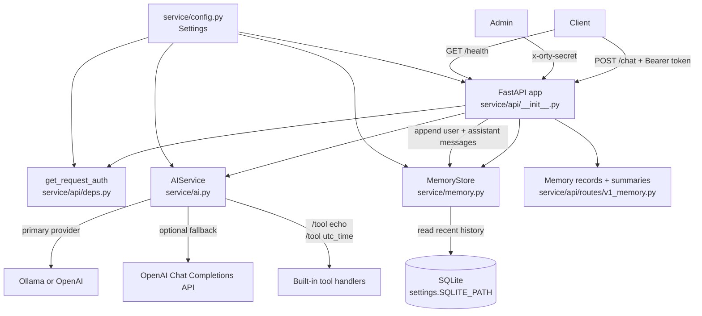

# Orty


Orty is a modular, on-device AI assistant built with FastAPI and designed for clean architecture, extensibility, and local-first operation. The project is currently in early alpha and focused on building a solid architectural foundation before feature expansion.

## Status

Version: v0.1.0-alpha
Current Phase: deployment cleanup + Cloud Run durability prep
Next Phase: PostgreSQL-backed beta cutover

---

## Current Roadmap Position

Orty is currently in **v0.1.0-alpha** and in the **deployment cleanup + durable beta cutover** phase.

### What is already in place
- FastAPI application structure and running server entrypoint
- Health endpoint, Alfred client registration, and request authentication via registered clients (with shared-secret admin fallback)
- Client auth lifecycle APIs (`/v1/auth/token`, `/v1/auth/rotate`, `/v1/auth/revoke`, `/v1/auth/me`, `/v1/auth/introspect`)
- Chat endpoint with OpenAI/Ollama provider routing, escalation envelope support, and response handoff metadata
- Built-in tool execution (`echo`, `utc_time`, and filesystem helper tools)
- SQLite-backed conversation memory with recent-history retrieval
- Client-scoped long-term memory APIs (`/v1/memory/records` CRUD + `/v1/memory/summaries` checkpoints)
- Alfred memory sync compatibility endpoints (`POST /memory/sync` and `POST /v1/memory/sync`) backed by canonical long-term memory records
- Supervisor-managed bot lifecycle APIs with `heartbeat`, `code_review`, `automation_extensions`, and `codey` bot types
- Conversation controls in `/chat` (`history_limit`, `reset_conversation`, `persist`)
- Safer tool contracts with bounded tool input and stricter `owner/repo` validation for GitHub tools
- Optional Orty cloud fallback path (`ENABLE_CLOUD_FALLBACK`) when local provider fails
- Request-scoped runtime dependency wiring so API routes, UI routes, and supervisor services share the active app runtime instead of module-level singletons
- Test runtime isolation for SQLite-backed APIs and supervisor flows, including safer async cleanup for bot tasks

### Deployment Readiness Markers

The deployment path is now tracked with explicit markers in [docs/DEPLOYMENT_ROADMAP.md](docs/DEPLOYMENT_ROADMAP.md):

- D0 Repo cleanup and deployment story alignment
- D1 PostgreSQL-backed Cloud Run beta cutover
- D2 Artifact-first beta release discipline

Current marker: D1 in progress

Google Cloud operator setup for the beta lane lives in [docs/GCP_BETA_SETUP.md](docs/GCP_BETA_SETUP.md).

### What comes next
The next planned milestone is **D1: PostgreSQL-backed Cloud Run beta cutover**.

### Integration Contract
- Alfred-Orty integration contract (auth, escalation, and memory roadmap): `docs/alfred-orty-integration-contract-v1.md`
- Codey supervised-worker integration request: `docs/codey-supervisor-integration-request-v1.md`
- Orty-related projects standard operating procedure: `docs/orty-related-projects-sop-v1.md`

### User Interface Status
- Orty now includes a **simple built-in web UI** for quick manual testing.
- Open `GET /ui` in a browser to chat as the primary root client without manually setting secrets, and continue conversations via `conversation_id`.
- The backend remains API-first (`/chat`, `/health`, and `/v1/...` endpoints), with the web UI acting as a lightweight test client.
- Creating Alfred clients via `POST /v1/clients/register` uses the configured Alfred client key, while creating additional admin clients via `POST /v1/clients` requires the admin shared secret (`x-orty-secret`).

### Deployment Shape

The intended production artifact for server-hosted Orty is a versioned container image built from the official source repo and deployed with environment-specific config and secrets injected at runtime.

Cloud Run beta target: `LLM_PROVIDER=vertex_ai` with no local Ollama dependency inside the container. PostgreSQL should be provided through `DATABASE_URL`, not SQLite on ephemeral disk.

---


### Codey coding-agent planning bot

Orty now includes a `codey` supervisor bot type that drafts an implementation plan for a coding agent architecture. The plan includes:
- Intent resolver + mode routing model stack
- Cloud primary LLM with local fallback strategy
- Docker sandbox execution policy and restricted network scope
- Alembic-based memory/context management notes
- Mode-specific system prompts for conversation, architecture, code generation, code review, and debugging

Create and run via the supervisor APIs:

```bash
POST /v1/bots
{
  "bot_type": "codey",
  "config": {
    "working_title": "Codey",
    "intent_model": "gwen3:0.6b",
    "main_model": "qwen3-coder:480b",
    "fallback_model": "qwen2.5:1.5b"
  }
}
```

After `POST /v1/bots/{bot_id}/start`, inspect `GET /v1/bots/{bot_id}/events` for `CODEY_*` planning events and architecture payloads.

---

## Architecture Overview

Orty follows a clean architecture approach:

* API Layer (FastAPI routers)
* Service Layer (business logic)
* Storage Layer (persistence abstraction)
* LLM Provider Abstraction (model interface layer)

The system is designed to support:

* Local or remote LLM providers
* Pluggable storage backends
* Secure request authentication
* Future tool integration and automation

### Project Architecture Diagram


```mermaid
flowchart TD
    C[Client] -->|POST /chat + Bearer token| API[FastAPI app\nservice/api/__init__.py]
    A[Admin] -->|x-orty-secret| API
    C -->|GET /health| API

    API --> AUTH[get_request_auth\nservice/api/deps.py]
    API --> AI[AIService\nservice/ai.py]
    API --> MEM[MemoryStore\nservice/memory.py]
    API --> LTM[Memory records + summaries\nservice/api/routes/v1_memory.py]

    MEM -->|read recent history| DB[(SQLite\nsettings.SQLITE_PATH)]
    API -->|append user + assistant messages| MEM

    AI -->|primary provider| PRIMARY[Ollama or OpenAI]
    AI -->|optional fallback| OAI[OpenAI Chat Completions API]
    AI -->|/tool echo\n/tool utc_time| TOOLS[Built-in tool handlers]

    CFG[service/config.py\nSettings] --> API
    CFG --> AI
    CFG --> MEM
    CFG --> AUTH
```

Request flow summary:
1. `/chat` authenticates request (`Bearer` token preferred; admin secret supported).
2. Orty loads recent conversation history and merges optional Alfred escalation context.
3. `AIService` executes tool calls or routes to the configured provider with optional cloud fallback.
4. User + assistant messages are persisted, and the reply returns with handoff metadata.

---

## Tech Stack

* Python 3.12+
* FastAPI
* Uvicorn
* SQLite (memory persistence enabled, WAL mode, configurable connection timeout)
* OpenAI and Ollama provider support
* Git for version control

Designed to run in Termux (Android) or any Linux environment.

---

## Project Structure

```
orty/
├── service/
│   ├── api/
│   ├── storage/
│   ├── supervisor/
│   └── ...
├── docs/
├── tests/
├── orty.py
├── requirements.txt
└── .env
```

Structure will evolve as persistence and conversation management are added.

---

## Setup Instructions

### 1. Clone the Repository

```
git clone https://github.com/ortluk-hub/Orty.git
cd Orty
```

### 2. Create Virtual Environment (Recommended)

```
python -m venv venv
source venv/bin/activate
```

### 3. Install Dependencies

```
pip install -r requirements.txt
```

### 4. Configure Environment Variables

Create a `.env` file in the project root:

```
ORTY_SHARED_SECRET=your_shared_secret_here
LLM_PROVIDER=ollama
OPENAI_API_KEY=your_openai_key_here
# optional cloud fallback from local failures
ENABLE_CLOUD_FALLBACK=false
CLOUD_FALLBACK_PROVIDER=openai
# set CLOUD_FALLBACK_PROVIDER=ollama_cloud to reuse Ollama Cloud on the same host
# OLLAMA_CLOUD_FALLBACK_MODEL=qwen3-coder:480b-cloud
# local model settings
# OLLAMA_BASE_URL=http://localhost:11434
# OLLAMA_MODEL=qwen2.5:3b
SQLITE_PATH=data/orty.db
SQLITE_TIMEOUT_SECONDS=5
ALLOW_LEGACY_CLIENT_HEADERS=true
```

`ORTY_SHARED_SECRET` is required for admin endpoints (`/v1/clients`, admin introspection/override flows).

---

## Running the Server

```
uvicorn service.api:app --host 0.0.0.0 --port 8080
```

Health check endpoint:

```text
GET /health
```

For local Alfred full-stack testing, you can run Orty and a fresh Cloudflare tunnel together with:

```bash
./scripts/start_local_stack.sh --sync-alfred
```

That script:
- starts Orty on `127.0.0.1:8081`
- starts a fresh `trycloudflare.com` tunnel
- prints the local health URL, homepage URL, and current tunnel URL
- prints a same-LAN URL when one is available
- updates Alfred's [`local.properties`](/home/ortluk/ortluk-hub/Alfred/Alfred/local.properties) `orty.base.url` and `orty.lan.base.url` when `--sync-alfred` is passed
- stores logs under `/tmp/orty-local-stack/`

To stop the local stack:

```bash
./scripts/stop_local_stack.sh
```

## Cloud Run Phase 1

Orty now has a deployment profile intended for the first Cloud Run cutover of the interactive Alfred path.

- Set `ORTY_DEPLOYMENT_PROFILE=cloud_run_interactive` to disable the in-process `/v1/bots` control surface.
- Use this profile for the public chat/auth/STT/TTS path only.
- Keep Codey and supervisor-style bot orchestration on separate infrastructure for now.
- This phase does **not** solve durable storage yet. `SQLITE_PATH` still points to SQLite, so a plain Cloud Run deploy should be treated as staging or smoke infrastructure until storage is migrated off the container filesystem.

See `docs/cloud-run-phase1.md` for the rollout order and `scripts/deploy_cloud_run_phase1.sh` for a starting deploy command.

Expected response:

```
{"status": "ok"}
```

## Running Orty + LLM in Separate Docker Containers (Same Host)

Use this setup when:
- Orty API runs in one container
- Ollama (LLM runtime) runs in a separate container
- Client devices are on the same LAN and call the Orty host directly

### 1. Create a dedicated Docker network

```bash
docker network create orty-net
```

### 2. Start the LLM container (Ollama)

```bash
docker run -d \
  --name ollama \
  --network orty-net \
  -p 11434:11434 \
  ollama/ollama
```

Pull the model you want Orty to use (example: `llama3.2`):

```bash
docker exec -it ollama ollama pull llama3.2
```

### 3. Build and run Orty container

From the Orty repository root (`Dockerfile` is included in this repo):

```bash
docker build -t orty:local .

docker run -d \
  --name orty \
  --network orty-net \
  -p 8080:8080 \
  -e ORTY_SHARED_SECRET=your_shared_secret_here \
  -e LLM_PROVIDER=ollama \
  -e OLLAMA_BASE_URL=http://ollama:11434 \
  -e OLLAMA_MODEL=llama3.2 \
  -e SQLITE_PATH=/app/data/orty.db \
  -v orty_data:/app/data \
  orty:local
```

### 4. Access from clients on the same network

Use the Orty host machine IP from client devices:

- Health: `http://<host-ip>:8080/health`
- Chat: `http://<host-ip>:8080/chat`

Example:

```bash
curl -X POST "http://<host-ip>:8080/chat" \
  -H "Content-Type: application/json" \
  -H "x-orty-secret: your_shared_secret_here" \
  -d '{"message":"Hello from LAN client"}'
```

Notes:
- `OLLAMA_BASE_URL` must use the Ollama container name (`http://ollama:11434`) when both containers are on the same Docker network.
- Keep port `8080` open on the host firewall for LAN clients.
- If Orty cannot reach Ollama, verify both containers are on `orty-net` (`docker network inspect orty-net`).


Tool usage (initial built-in support):

- Use `/tool echo <text>` to return text directly
- Use `/tool utc_time` to return current UTC timestamp

If a tool command is used, Orty executes the tool first and returns the tool result.

Chat endpoint now supports lightweight memory persistence via SQLite:

Supervisor automation notes:

- `code_review` bots can clone a target repository, inspect configured roadmap text, and emit roadmap-aligned change proposals via `/v1/bots/{bot_id}/events`.
- The bot can optionally use `conversation_id` memory to weight proposal relevance from recent chat history.
- Every proposal includes `human_review_required=true`; generated ideas are intended for human-reviewed pull requests before merge.
- `automation_extensions` bots generate integration-target execution plans (for example: GitHub, Slack, and Notion) and raise target priority when chat memory shows explicit demand.


- include optional `conversation_id` in `/chat` requests to continue a thread
- if omitted, Orty creates a new `conversation_id` and returns it in the response

---

## Authentication

Preferred runtime authentication is bearer token per client instance:

1. Provision client identity (admin):
```
POST /v1/clients
x-orty-secret: <admin-secret>
```

2. Exchange client credentials:
```
POST /v1/auth/token
{
  "client_id": "...",
  "client_token": "..."
}
```

3. Use bearer token:
```
Authorization: Bearer <access_token>
```

Compatibility mode:

```
x-orty-secret: <your_shared_secret>
```

`x-orty-secret` is still valid for admin operations and root testing flows.

---

## Development Workflow

* `main` branch → Stable releases
* `dev` branch → Active development

Create features in `dev` and merge when ready.

Version tags are used for milestone tracking.

---

## Roadmap

### What’s next (near-term)
1. **Conversation lifecycle controls**
   - Add explicit APIs to inspect/reset/archive conversations
   - Improve conversation metadata handling for multi-session usage
2. **Safer, extensible tool contracts**
   - Formalize tool input/output schemas and validation rules
   - Add guardrails (path limits, execution policy, audit logging)
3. **Automation + integration expansion**
   - Add structured hooks for scheduled/triggered actions
   - Prepare connectors for external services while keeping local-first defaults

### Full roadmap
* Conversation management system
* Advanced memory retrieval + summarization
* Expanded secure automation integrations
* LLM abstraction layer
* Tool execution framework
* Background task system
* Smart home and automation integrations
* On-device model support

---

## Philosophy

Orty is built as a system, not a script.
The focus is clean structure, modularity, and long-term scalability.

---

If you'd like, we can now:

* Add a version badge
* Add a project architecture diagram
* Prepare a v0.2 milestone plan
* Or wire in SQLite and commit the next evolutionary step

Orty is now officially documented.
